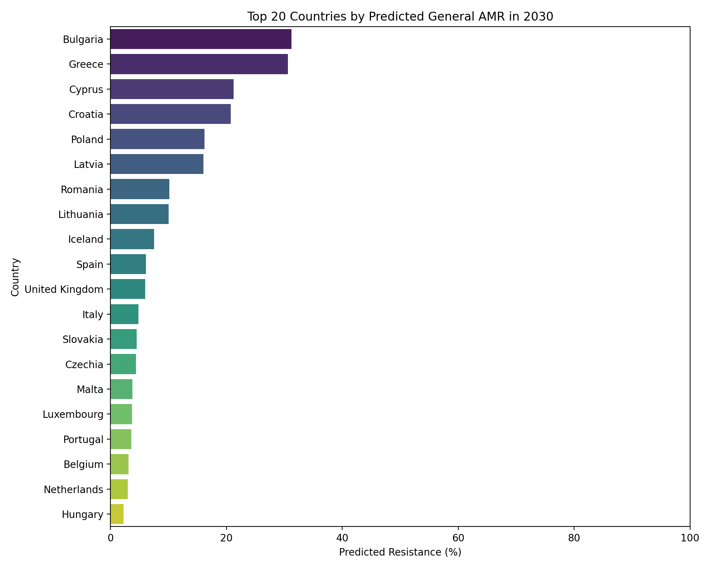
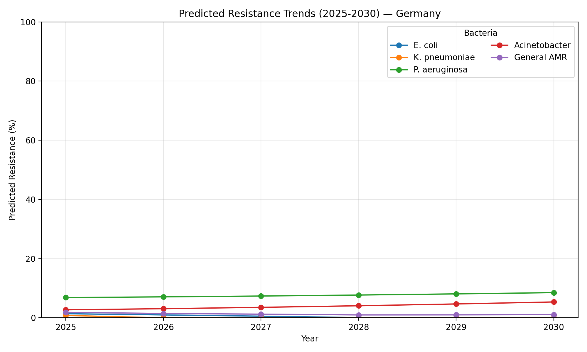

# Antimicrobial Resistance Outlook 2025–2030

A concise, decision-oriented summary of our analyses on resistance trends, country similarity, and Turkey-specific projections.

## What we set out to answer

- How are key pathogens’ resistance levels likely to evolve across European countries through 2030?
- How can we summarize organism-specific results into a single, comparable indicator for each country and year?
- Which countries are most similar to Turkey based on recent resistance and antibiotic use profiles?
- What does this imply for Turkey’s resistance trajectory by 2025 and 2030?

## How we approached it (no code)

- Harmonized organism labels and focused on percentage-based resistance metrics.
- For each country–organism, fitted a simple quadratic trend to historical resistance percentages and projected annually to 2030. Values are bounded between 0–100%.
- Built a composite “General AMR” score per country–year by weighting organisms by approximate encounter frequency:
  - E. coli (40%), K. pneumoniae (30%), P. aeruginosa (20%), Acinetobacter (10%).
- Identified countries most similar to Turkey using standardized features (recent E. coli and S. aureus resistance, antibiotic consumption, and near-term average resistance) and cosine similarity.
- For Turkey, estimated 2025–2030 paths using trends observed in the two most similar countries.

## What the forecasts show (Europe-wide)

- Resistance remains heterogeneous: some countries trend downward while others stay high or plateau.
- The composite indicator highlights a cluster of countries with notably higher overall resistance pressure by 2030.
- Pathogen profiles vary by country: E. coli and K. pneumoniae often dominate composite levels; P. aeruginosa and Acinetobacter add pressure in intensive-care contexts.

## Country trend example

- Example trajectories illustrate smooth, directionally informative patterns. Year-to-year noise is reduced by the simple trend, while keeping results interpretable.

## Which countries resemble Turkey the most?

- Using the latest available resistance and antibiotic use profiles, the most similar countries are led by:
  - Cyprus
  - Italy
  - Croatia
  - Greece
  - Poland
- This provides a practical reference set for benchmarking and for anticipating how interventions might perform in a comparable context.

## Turkey: projected resistance, 2025–2030

- Approach: Apply the average annual trend from the two closest peers to Turkey’s latest measured levels, then extend annually to 2030. Where organism-level peer forecasts were not available, we applied the same trend as for E. coli.
- Headline results:
  - E. coli: 23.6% in 2025, declining to 8.4% by 2030.
  - S. aureus: 13.6% in 2025, declining to 4.9% by 2030.
- Interpretation: Under peer-like trajectories, Turkey sees a sustained decline across both organisms from current elevated levels. This aligns with broader regional declines among peers with active stewardship and infection prevention efforts.

## How to read these results

- Organism lines provide organism-specific context; the composite indicator is a high-level proxy useful for ranking and communication.
- Projections are directional—not precise point predictions. They assume continuity of recent trends and do not embed policy changes unless they are already reflected in the data.
- Declines in the projections should be interpreted as opportunities to lock in gains via stewardship, vaccination, IPC, diagnostics, and supply quality measures.

## Policy takeaways

- Prioritize countries and organisms with highest projected burden for targeted stewardship and surveillance.
- Use the similarity set to select relevant policy comparators for Turkey, focusing on interventions shown to correlate with declines in peers.
- Monitor consumption and resistance jointly: progress typically reflects coordinated action on antimicrobial use, IPC, and clinical practice.

## Caveats and next steps

- Uncertainty not shown: Future iterations should include intervals (e.g., bootstrap or Bayesian) to convey range.
- Add drivers: Enrich models with antibiotic consumption, stewardship policies, demographics, and healthcare capacity.
- Expand coverage: Additional organisms, settings, and external validation against independent datasets and expert review.
